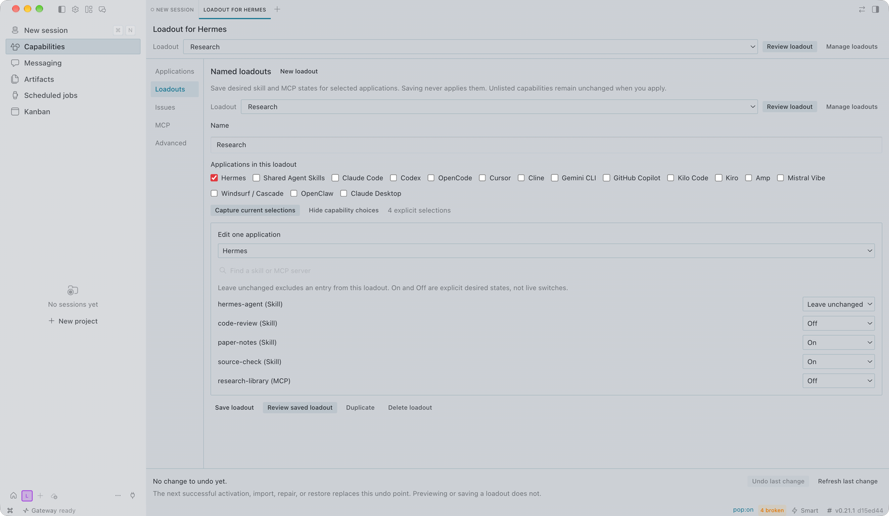
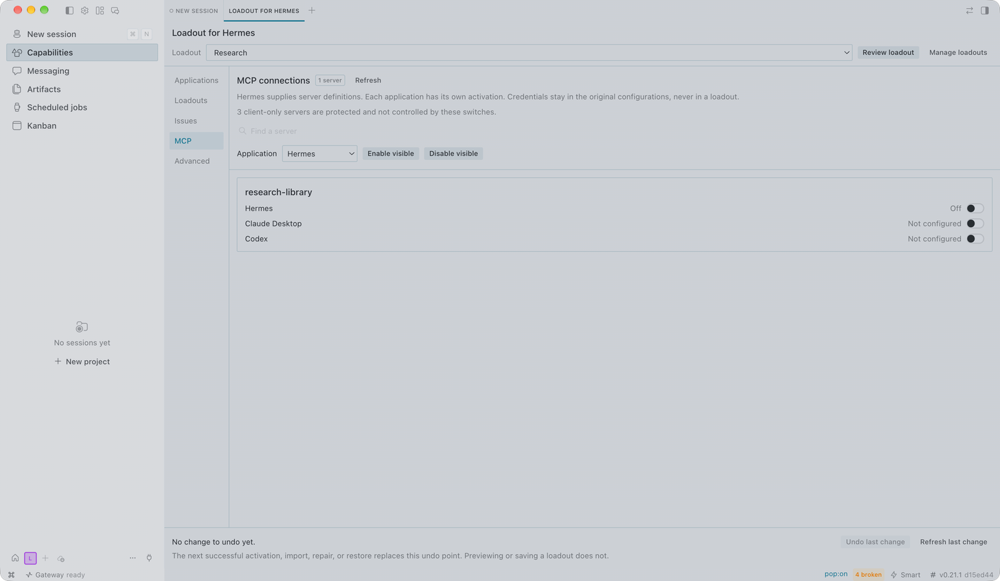
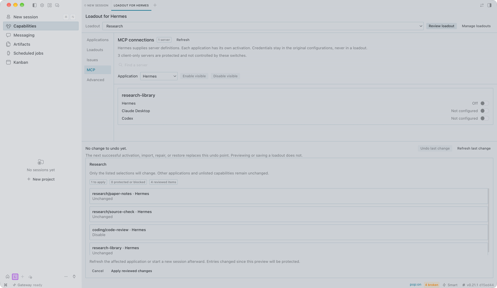

# Loadout for Hermes

**Choose the skills and tool connections your agents can use—from one place in Hermes Desktop.**

Loadout helps you manage two parts of an agent's setup:

- **Skills:** reusable instructions that teach an agent how to do a task. Keep one library and choose which skills each supported app can access.
- **MCP connections:** connections to external tools and services. Choose which existing, supported connections are available in Hermes, Claude Desktop, or Codex.

Save those choices as a **loadout**, such as Research or Coding. Review what will change, apply it, and inspect the result. You don't have to maintain a separate copy of every skill for every agent.

> **Early alpha.** Best suited to people using multiple agents or a growing collection of skills and connections. Supported paths are not a guarantee that every client/version works end to end. Loadout does not install agents, set up credentials, or manage your conversations.



<details>
<summary>MCP connections and change review</summary>





</details>

[Get started](#get-started) · [Save a loadout](#save-a-loadout) · [Supported apps and connections](#supported-apps-and-connections) · [Safety and recovery](#safety-and-recovery)

## Get started

You need Hermes Desktop with [unified desktop plugin support](https://hermes-agent.nousresearch.com/docs/developer-guide/desktop-plugin-sdk). Start with a reviewed [prerelease](https://github.com/qwertyuiop97/hermes-loadout/releases), not an arbitrary development checkout. This project does not yet publish a tested minimum Desktop version.

For the **default local Hermes profile**, install the published alpha:

```bash
git clone --branch v0.1.0-alpha.1 --depth 1 \
  https://github.com/qwertyuiop97/hermes-loadout.git \
  ~/.hermes/plugins/hermes-loadout
hermes plugins enable hermes-loadout
```

Then:

1. Enable **Loadout for Hermes** in **Settings → Plugins** in Desktop.
2. Fully quit and reopen Hermes so the matching backend loads.
3. Open **Loadout**. Its compact pane summarizes your setup; **Open Loadout** opens the full workspace.

Both plugin halves must be enabled. There is no frontend build step.

**Other profiles or a remote backend?** The example above is only for the default local profile. Use the active profile's plugin directory and enable the backend in that same profile. `HERMES_HOME` takes precedence over `HERMES_PROFILE`; otherwise the home is `~/.hermes`. The installation directory must be named `hermes-loadout`. With a remote backend, displayed paths are on that machine—not your desktop—and the desktop half must also be installed locally. See the [official plugin guide](https://hermes-agent.nousresearch.com/docs/developer-guide/desktop-plugin-sdk) for host setup.

### Make your first change

1. **Inspect what you have.** Open **Applications** for skills, or **MCP** for connections already defined in Hermes.
2. **Bring in skills if needed.** **Scan & import** reads the folders you select. Review the results, then choose what to import. Scanning does not change files or turn anything on.
3. **Choose one change.** Open an application's **Manage** view and change one skill, or choose a supported MCP connection.
4. **Review and apply.** Check the application, requested changes, and any protected entries before confirming.
5. **Read the receipt.** Check what completed and what did not. Refresh the affected client or start a new session before expecting its available skills/connections to change.

Try **Undo last change** to preview a reversal. It is available only while the affected state can still be safely restored; it is not unlimited history.

## Save a loadout

A loadout is a named set of desired **On**, **Off**, or **Leave unchanged** choices for selected apps. It can include both skills and MCP connections.

For example, a **Research** loadout could turn on your research skills and an existing supported reference-search connection in Codex. A **Coding** loadout could choose a different set. These are examples, not bundled presets or newly installed services.

1. Open **Loadouts → New loadout** and give it a name.
2. Choose the applications it covers.
3. **Capture current selections**, or edit the skill and MCP choices yourself.
4. **Save loadout**. Saving does not change any application's setup.
5. Select it and **Review loadout** when you want to apply its saved choices.

**Leave unchanged** excludes an item from the loadout; it does not mean Off. New skills and unlisted connections stay untouched. Protected or unavailable entries are reported, not guessed. You can rename, duplicate, or delete a saved loadout without changing live application settings.

Loadout files contain names, identifiers and On/Off choices—not credentials, server definitions, or copied skill contents.

## How skills and connections are managed

| Action | What it does | What it does not do |
|---|---|---|
| Scan | Reads selected skill folders and reports what it finds. | Install apps, import skills, or enable anything. |
| Import | Adds a reviewed skill copy to the Hermes library. | Enable it in every agent. |
| Skill On / Off | Changes Hermes's disabled-skill setting, or creates/removes an individual managed link for another app. | Delete the library copy or override a client's trust rules. |
| MCP On / Off | Updates a supported connection's availability for the selected app. | Create credentials, complete OAuth, or prove the service is running. |
| Save loadout | Stores the choices you want to reuse. | Apply those choices. |

The skill library lives at `<hermes_home>/skills/<category>/<name>/SKILL.md`. A skill can stay in the library while being off everywhere.

A skill imported from an ordinary folder starts **off in Hermes** and gets no application links. A skill already active in a source application keeps that application's access; other applications and existing Hermes selections are unchanged. The original application copy is preserved outside its discoverable skills folder.

**Apps that share a skills folder share its settings.** Loadout warns about this rather than pretending their switches are independent. A client can also read skills from other locations or retain an old session's catalog; Loadout cannot override that behavior.

## Supported apps and connections

Skill support and MCP support are separate:

| Capability | Supported setup |
|---|---|
| Hermes skills | The active profile's library and `skills.disabled` setting. |
| Other apps' skills | Documented Global/Project locations from the client catalog, plus explicit Custom mappings. |
| Hermes MCP | Existing server definitions in Hermes `config.yaml`, with independent enabled state. |
| Claude Desktop MCP | Supported local-command connections (stdio). |
| Codex MCP | Supported local-command and HTTP connections. |

Claude Code skill support does **not** imply a Claude Desktop skill directory. A client listed for skills does **not** automatically have an MCP writer.

MCP changes preserve unrelated settings and client-only connections. A conflicting definition needs manual resolution; Loadout does not force an overwrite. Client trust, permissions, transport support and refresh requirements still apply.

### Add an application

Open **Applications → Add Tool** and review its path before **Use this path**. This saves a mapping, not an enabled skill set. A later reviewed change may create the skills folder. Finding a folder does not prove the client is installed or has loaded it.

- **Global:** a location within your user home.
- **Project:** a supported location inside an existing project folder you explicitly choose. Loadout does not search your computer for projects.
- **Custom:** a path you review yourself—not certification of an unknown client's format.

Moved or redirected project paths remain read-only until reviewed. Current Codex targets use `.agents/skills`; saved Custom paths are not silently redirected.

<details>
<summary>Documented skill locations</summary>

These are documented candidates, not a claim of end-to-end testing for every client and operating system. The [client catalog](dashboard/client_catalog.json) records sources, platforms and limitations.

<!-- client-catalog:start -->
| Client | Global path | Project path |
|---|---|---|
| [Shared Agent Skills](https://developers.openai.com/codex/skills/) | `~/.agents/skills` | `.agents/skills` |
| [Claude Code](https://code.claude.com/docs/en/skills) | `~/.claude/skills` | `.claude/skills` |
| [Codex](https://developers.openai.com/codex/skills/) | `~/.agents/skills` | `.agents/skills` |
| [OpenCode](https://opencode.ai/docs/skills/) | `${OPENCODE_CONFIG_DIR:-~/.config/opencode}/skills` | `.opencode/skills` |
| [Cursor](https://cursor.com/docs/skills) | `~/.cursor/skills` | `.cursor/skills` |
| [Cline](https://docs.cline.bot/customization/skills) | `~/.cline/skills` | `.cline/skills` |
| [Gemini CLI](https://geminicli.com/docs/cli/skills/) | `~/.gemini/skills` | `.gemini/skills` |
| [GitHub Copilot](https://docs.github.com/en/copilot/how-tos/copilot-on-github/customize-copilot/customize-cloud-agent/add-skills) | `~/.copilot/skills` | `.github/skills` |
| [Kilo Code](https://kilo.ai/docs/customize/skills) | `~/.kilo/skills` | `.kilo/skills` |
| [Kiro](https://kiro.dev/docs/skills/) | `~/.kiro/skills` | `.kiro/skills` |
| [Amp](https://ampcode.com/docs/customize/skills) | `~/.config/agents/skills` | `.agents/skills` |
| [Mistral Vibe](https://docs.mistral.ai/vibe/code/cli/skills) | `~/.vibe/skills` | `.vibe/skills` |
| [Windsurf / Cascade](https://docs.devin.ai/desktop/cascade/skills) | `~/.codeium/windsurf/skills` | `.windsurf/skills` |
| [OpenClaw](https://docs.openclaw.ai/tools/skills) | `~/.openclaw/skills` | Not offered |
<!-- client-catalog:end -->

</details>

Grok, ZCode, Kimi, pi, and Roo Code remain unverified candidates. Agent Skills targets need valid frontmatter, a supported name matching the folder, and a description. OpenClaw's project path is not offered because Loadout does not relax its external-link trust settings. Local links to a Hermes library are not portable team or cloud-agent packages.

## Find your way around

| View | Use it to… |
|---|---|
| Applications | Manage skills for detected or configured targets. Search and filter by state, category, source, or informational “Designed for” labels. |
| Loadouts | Save, edit and review reusable skill/MCP choices. |
| Issues | Inspect broken links, conflicting copies and protected entries. |
| MCP | Manage supported connections already defined in Hermes. |
| Advanced | Access setup, imports, notifications and recognized backups. |

“Portable” and application-specific skill labels are your organizational labels, not compatibility guarantees. The optional matrix is for wide workspaces; narrow workspaces use a section selector.

## Safety and recovery

**You review capability changes before they are applied.** If a plan expires or its inputs change, review it again. A receipt distinguishes completed changes from unchanged, unavailable or protected entries.

- Real directories, foreign links and user-managed files are protected. Conflicting skill copies require an explicit choice; Loadout does not automatically merge or rename them.
- A link exposing the whole library can bypass individual Off switches. **Issues** identifies this “catalog bypass.” A reviewed repair removes only the verified broad link, not its library contents.
- Imports recheck selected contents and destination boundaries before copying. Changed sources and redirected destinations are refused.
- **Undo last change** previews what can still be restored. External edits and changed backups are preserved. A new successful operation replaces the previous undo point; previews, refusals and no-ops do not.
- **Advanced** lists recognized backups and previews whole-file or skill-copy restores. A configuration restore restores that file's saved settings, not just one toggle. Full Hermes YAML-backup restore requires PyYAML in the backend and rejects malformed or duplicate-key documents.

**An interrupted change is not the same as no change.** Stop retrying, refresh the result, and preserve the pending record and referenced backups. Do not delete a journal to dismiss the warning. Follow the [recovery triage guide](docs/development.md#recovery-triage) on disposable copies, or ask for help through a private channel.

> **Backups may contain credentials and are not encrypted.** Receipts avoid secret configuration snapshots, but paths and server names can still be sensitive. Never attach raw backups, configurations or receipts to public issues. See [Security](SECURITY.md).

These protections are for ordinary local operations, not hostile processes with your filesystem privileges. Multi-file changes are not one atomic transaction. On Windows, creating directory links may require Developer Mode or privileges.

## Troubleshooting

| Symptom | Next step |
|---|---|
| Missing backend or version mismatch | Enable the matching backend in the intended profile, fully restart Hermes, and retry. |
| A path is missing or moved | Review the application/project path; do not strip its scope metadata. |
| A scan cannot read a source | Check the selected path and permissions, then rescan. Do not treat a failed scan as an empty folder. |
| A change is refused | Read the item reason, correct the underlying issue, and create a new preview. |
| The client still shows old skills/connections | Refresh it or start a new session; check its trust rules and other discovery locations. |
| An operation needs recovery | Preserve the journal/originals and use [read-only recovery triage](docs/development.md#recovery-triage). |

For a reproducible bug, use the [alpha feedback template](.github/ISSUE_TEMPLATE/alpha-feedback.md). Include revisions and sanitized steps, not personal configuration files.

## Update, roll back, or uninstall

### Update a pinned installation

The install command above checks out a **tag**, not a tracking branch. Do not use `git pull` as a pinned-release upgrade procedure.

1. In the plugin checkout, run `git status --short`. Preserve local changes before proceeding; do not overwrite them.
2. Choose a reviewed tag from [Releases](https://github.com/qwertyuiop97/hermes-loadout/releases). Note your current revision with `git rev-parse HEAD`.
3. Fetch that exact tag with `git fetch --depth 1 origin tag TAG`, replacing `TAG` with the selected release tag.
4. Review the release notes and changes, then use `git switch --detach TAG`.
5. Fully restart Hermes. Verify both plugin halves and inspect your setup before applying changes.

To roll back the **plugin code**, switch back to the recorded revision or fetch/switch to its release tag. This does not undo prior skill or MCP changes and does not guarantee that newer saved data works with an older version. Review compatibility and retain data/backups first. Backend and manifest edits require a full restart; Desktop-only edits can use **Reload desktop plugins**.

### Uninstall

First review removal of any unwanted managed links or MCP entries. Then disable `hermes-loadout` in the CLI and Desktop settings and remove only its installation folder. Uninstalling does not reverse previous operations. The library, saved loadouts, settings and backups remain until you deliberately remove them. **Never delete the Hermes skill library just to uninstall Loadout.**

Settings live at `<hermes_home>/hermes-loadout.json`. Earlier development IDs/settings are not loaded or automatically migrated; review any old personal development setup separately.

## Development

See [development and validation](docs/development.md), [contributing](CONTRIBUTING.md), and [security](SECURITY.md). Core adapters remain importable on Python 3.9+; a [licensed TOML reader](dashboard/_vendor/README.md) is bundled. HTTP tests use pinned dependencies, and some YAML operations require the backend's PyYAML parser.

Filesystem tests, React/SDK-substitute harnesses and SDK export checks are not native Desktop verification. Follow the documented disposable-profile acceptance checks before claiming a supported release. Loadout includes no telemetry, provider switching, marketplace, cloud synchronization or session management.

## License

MIT. The vendored TOML reader retains its own MIT attribution.
