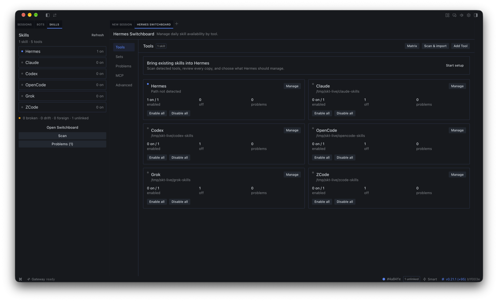

# Hermes Switchboard

[](https://github.com/qwertyuiop97/hermes-switchboard/actions/workflows/tests.yml)

Hermes Switchboard manages the skills and MCP connections used by your AI
coding tools. It runs inside the Hermes desktop app.

If you use several coding agents, their skills usually end up scattered across
different hidden folders. Copies fall out of date, new skills must be added to
each tool, and it becomes difficult to tell what is enabled where. Switchboard
keeps one canonical skill library in Hermes and gives you a single place to
control which tools can use each skill.



_The compact Skills pane beside the full Switchboard workspace. This screenshot
uses an isolated test profile._

## What it helps with

- See which skills are enabled for each coding tool.
- Enable or disable every skill for one tool without working through a long
  list of switches.
- Find broken links, out-of-date copies, and skills that are not connected to
  any tool.
- Bring existing skill folders into Hermes through a reviewed import.
- Keep selected MCP server definitions in sync with Claude Desktop and Codex.
- Add another client by pointing Switchboard at its skills directory.

Switchboard is most useful for Hermes users who work with more than one coding
agent or maintain a large skill collection. It is probably unnecessary if you
use one agent with only a few skills.

## How it works

Hermes remains the source of truth. Other tools receive symlinks to the skill
directories in Hermes, so there is no second copy to maintain. Turning a skill
off removes only that tool's symlink. It does not delete the skill.

The small Skills pane is a status summary. Open the main Switchboard workspace
for management:

- **Tools** shows one card per configured client, with enabled, disabled, and
  problem counts. Each card has Manage, Enable all, and Disable all actions.
- **Sets** applies reusable skill selections such as Coding, Writing, or
  Minimal.
- **Problems** lists broken links, drifted copies, unlinked skills, and
  protected directories that Switchboard will not modify automatically.
- **MCP** mirrors servers from the Hermes catalog into supported clients.
- **Advanced** contains custom paths, imports, backups, watch preferences, and
  machine blueprints.

An optional matrix is available on wide layouts. Narrow panes use the tool-first
views instead of squeezing dozens of switches into each row.

## Supported clients

Switchboard detects these skill locations by default:

| Client | Default skills directory |
|---|---|
| Hermes | `~/.hermes/skills` |
| Claude | `~/.claude/skills` |
| Codex | `~/.codex/skills` |
| OpenCode | `${OPENCODE_CONFIG_DIR:-~/.config/opencode}/skills` |
| Grok | `~/.grok/skills` |
| ZCode | `~/.agents/skills` with `~/.zcode/skills` as a fallback |

You can add another client from **Tools -> Add Tool** if it uses a normal skills
directory. Switchboard does not claim automatic compatibility with every agent;
custom clients should be tested against disposable folders first.

## Safety

Switchboard treats filesystem changes as operations that need to be reviewed.

- Bulk changes show a dry-run preview before anything is written.
- Receipts list each changed, unchanged, and refused item.
- The most recent receipt can be undone from the interface.
- Real directories and foreign symlinks are protected rather than overwritten.
- Configuration writes create timestamped backups first.
- Skill sources are never deleted when a tool is disabled.
- MCP environment values are redacted from UI state, receipts, and logs.

The first-run scan is read-only until you review and confirm an adoption plan.
Extra scan folders are treated as sources, not additional canonical stores.

## Install

Clone the plugin into the Hermes plugins directory:

```bash
git clone https://github.com/qwertyuiop97/hermes-switchboard.git \
  ~/.hermes/plugins/hermes-switchboard
hermes plugins enable hermes-switchboard
```

Then:

1. Open Hermes and go to **Settings -> Plugins**.
2. Enable **Hermes Switchboard**.
3. Fully quit and reopen Hermes.
4. Open the Skills pane and choose **Open Switchboard**.

Both halves are opt-in. The CLI command enables the Python backend; the desktop
setting enables the interface. A full restart is required after installation
because Hermes loads the backend routes at startup. Closing only the window is
not enough.

You can also install with the Hermes CLI:

```bash
hermes plugins install qwertyuiop97/hermes-switchboard
hermes plugins enable hermes-switchboard
```

Or use the desktop deep link:
[Install in Hermes](hermes://plugin/install?repo=qwertyuiop97/hermes-switchboard).
Hermes asks for confirmation before installing a plugin from a deep link.

### Updating

```bash
git -C ~/.hermes/plugins/hermes-switchboard pull --ff-only
```

Fully quit and reopen Hermes when the backend or manifest changed. The command
palette action **Reload desktop plugins** is enough only when
`desktop/plugin.js` changed by itself.

### Profiles and custom Hermes homes

Switchboard honors `$HERMES_HOME` and `$HERMES_PROFILE`. For a named profile,
install it under that profile's `plugins/hermes-switchboard` directory and
enable it in the same profile.

## First run

1. Select the detected skill folders to scan. You may add another folder.
2. Review managed links, unique copies, duplicates, drift, and protected items.
3. Choose the clients and safe copies you want Hermes to manage.
4. Review the dry run, confirm it, and keep the receipt.
5. Use **Tools** for day-to-day changes and **Problems** when the status count is
   nonzero.

If a scan finds nothing, no files are changed. You can choose different sources
or return to Tools.

## Custom client paths

Use **Tools -> Add Tool**, or create
`<hermes_home>/hermes-switchboard.json`:

```json
{
  "tools": {
    "claude": "~/.claude/skills",
    "cursor": {
      "label": "Cursor",
      "dir": "~/.cursor/skills"
    }
  }
}
```

`~` and `${VAR:-default}` are expanded in directory paths. The configuration
file lives outside the plugin folder, so updating the plugin does not replace
it.

## MCP connections

The `mcp_servers` section of the Hermes `config.yaml` file is the catalog.
Switchboard can mirror the universal server fields (`command`, `args`, `env`,
`url`, and `headers`) into:

- Claude Desktop's `claude_desktop_config.json`
- Codex's `config.toml`

Copies that differ from Hermes require explicit overwrite confirmation. Servers
that exist only in a client remain visible and untouched. OpenCode MCP writing
is not supported yet because arbitrary JSONC files cannot be rewritten safely
without preserving user comments.

## Troubleshooting

**The pane says the backend is unavailable or returns 404.** Make sure the
plugin is enabled, then fully quit and reopen Hermes:

```bash
hermes plugins enable hermes-switchboard
```

**The new interface appears, but bulk actions return `405 Method Not Allowed`.**
The desktop bundle is newer than the backend still running in memory. Fully quit
and reopen Hermes. Reloading desktop plugins does not reload Python routes.

**The pane does not appear.** Confirm the folder is named
`hermes-switchboard`, enable **Hermes Switchboard** in **Settings -> Plugins**,
and restart the app.

## Development

The backend is dependency-free Python and supports Python 3.9 or newer. The
render harness requires Node.js 18 or newer.

```bash
python3 -m unittest tests.test_core_api tests.test_mcp_backend \
  tests.test_plugin_api tests.test_v2_backend \
  tests.test_bulk_planning tests.test_scan_wizard
.venv/bin/python3 -m unittest tests.test_routes_http
python3 tests/check_frontend.py
./tests/run_render_harness.sh
```

The test suite covers path validation, linking and unlinking, protected-entry
refusals, bulk previews, receipts, undo, imports, backups, MCP projections,
Python 3.9 imports, accessibility labels, narrow and wide layouts, and a
105-skill fixture.

## Current limitations

- The project is still an alpha. Test it with disposable client directories
  before pointing it at an important setup.
- Default skill-path detection covers the clients listed above. Other clients
  require a custom path.
- MCP writing currently supports Claude Desktop and Codex only.
- Windows and Linux core behavior is covered in CI, while the installed desktop
  workflow has been tested on macOS.

## Uninstall

```bash
hermes plugins disable hermes-switchboard
rm -rf ~/.hermes/plugins/hermes-switchboard
```

Uninstalling the plugin does not delete the Hermes skill library or the target
directories it created. Symlinks that were enabled before uninstalling remain
until you remove them or reinstall Switchboard and disable them.

## License

MIT. See [LICENSE](LICENSE).
